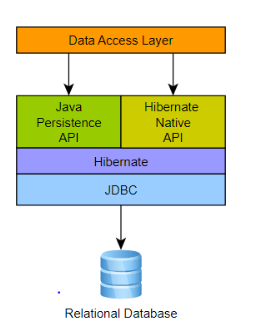

# Hibernate

This a small project that includes basic examples on how to work with the Hibernate ORM

## What is Hibernate?
Hibernate is a **framework** that implements the **JPA** (Java Persistence API) **ORM**.

Since we will be using an implementation of the JPA, we have to know how does the JPA works.
For the JPA to work properly, we use **annotations**(@) for mapping the elements of a Java class.

Please note that JDBC is still present even though we are working with an ORM. When we use Hibernate or any other implementation of a JPA, the JDBC is still in the below side:



Therefore, we can say that **Hibernate** is just a **JPA provider**. 
Other JPA providers: `Eclipselink`, `Toplink`, etc.


## How to make Hibernate to work
### Dependencies
For making Hibernate to work, as commented previously, we still need to use the JDBC. Therefore, make sure to add this dependency for your database connection. An example of this for MySQL could be the following (in the `pom.xml` file of the project):
```xml
<dependency>
    <groupId>com.mysql</groupId>
    <artifactId>mysql-connector-j</artifactId>
    <version>9.4.0</version>
</dependency>
```

Once you have this dependency, we can already think to use any **JPA**. For Hibernate:
```xml
<dependency>
    <groupId>org.hibernate</groupId>
    <artifactId>hibernate-core</artifactId>
    <version>7.1.4.Final</version>
</dependency>
```

### Configuration
Once we have already met the dependencies needed, you can create the Hibernate config file (Necessary to establish the connection to the database).
For doing this in an easy way in IntelliJ:
- File → Project Structure → Facets, + , Add → Hibernate

This will generate a file in the resources folder called `hibernate.cfg.xml` with a content similar to this:
```xml
<?xml version='1.0' encoding='utf-8'?>
<!DOCTYPE hibernate-configuration PUBLIC
"-//Hibernate/Hibernate Configuration DTD//EN"
"http://www.hibernate.org/dtd/hibernate-configuration-3.0.dtd">
<hibernate-configuration>
<session-factory>
<property name="connection.url"/>
<property name="connection.driver_class"/>
 <property name="connection.username"/> 
 <property name="connection.password"/> 
 <property name="hibernate.hbm2ddl.auto">update</property> 
</session-factory>
</hibernate-configuration>
```

Please make sure to change the values of the properties to the ones your project requires.

# Creating the factory class
Now we are prepared to establish a connection to the database, but we need to make this via Java code. For doing this, we create a HibernateUtil class (Inside the util package), which will follow a `singleton` pattern:
```java
package org.example.util;

import org.hibernate.SessionFactory;
import org.hibernate.boot.Metadata;
import org.hibernate.boot.MetadataSources;
import org.hibernate.boot.registry.StandardServiceRegistry;
import org.hibernate.boot.registry.StandardServiceRegistryBuilder;

public class HibernateUtil {
    private static StandardServiceRegistry registry;
    private static SessionFactory sessionFactory;
    public static SessionFactory getSessionFactory() {
        if (sessionFactory == null) {
            try {
                // Create registry
                registry = new StandardServiceRegistryBuilder().configure().build();
                // Create MetadataSources
                MetadataSources sources = new MetadataSources(registry);
                // Create Metadata
                Metadata metadata = sources.getMetadataBuilder().build();
                // Create SessionFactory
                sessionFactory = metadata.getSessionFactoryBuilder().build();
            } catch (Exception e) {
                e.printStackTrace();
                if (registry != null)
                    StandardServiceRegistryBuilder.destroy(registry);
            }
        }
        return sessionFactory;
    }
    public static void shutdown() {
        if (registry != null)
            StandardServiceRegistryBuilder.destroy(registry);
    }
}
```

## Mapping the entities 
We can finally map our entity classes to the JPA with annotations.

Inside a package called identities, we create the different identities that we want to have in our project.

All annotations:
@Entity: specifies that the class represents a DB entity
- @Table: defines the table that is related with the class
- @Id: specifies that the attribute is a PK
- @Column: specifies that the attribute is a column in the DB
- @OneToMany: 1:M relation
  - Specified in the related table.
  - FetchType.Lazy indicates that a table will only be loaded when it is used and not before
- @ManyToOne: M:1 relation 
- @JoinColumn: relates an attribute to a column that is FK

See [implementation examples](https://github.com/DavMunHer/DataAccess/tree/main/Hibernate/src/main/java/org/example/entities)


Once you have defined your entities, make sure to add them to your `hibernate.cfg.xml`:
```xml
<mapping class="org.example.entities.Cliente"/>
<mapping class="org.example.entities.Cuenta"/>
```

After doing all this you are all done to implement whatever you need to, but there can be some improvements, such as using DAO (Data Access Object) for separating the business logic of the app, where you define the actions you would like to do with each entity.

For doing this, you can refer to [these examples](https://github.com/DavMunHer/DataAccess/tree/main/Hibernate/src/main/java/org/example/dao).
In the above examples, you can see the necessary queries for performing actions. These queries are made in HQL (Hibernate Query Language). You can refer to these [docs](https://docs.hibernate.org/orm/7.1/querylanguage/html_single/) for more details